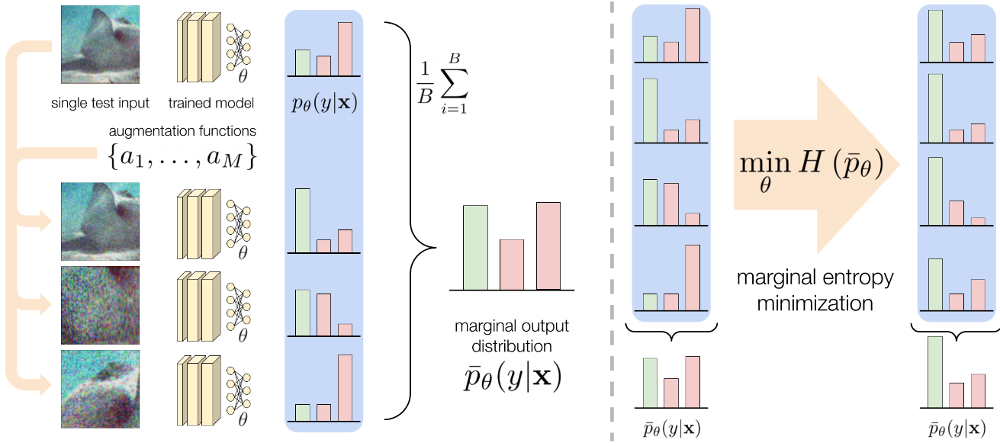
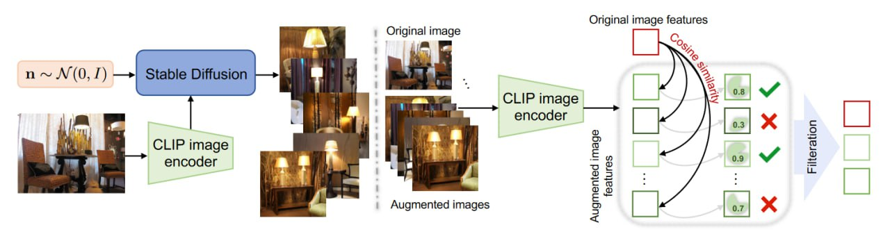
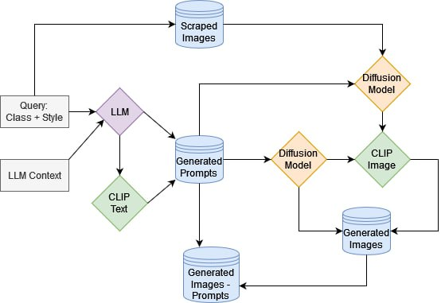
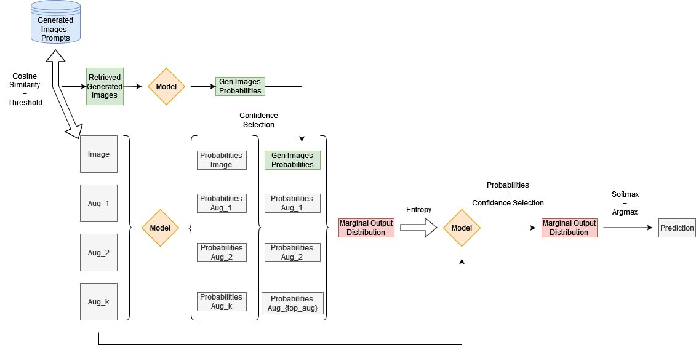

# Domain-Shift-Computer-Vision

In machine learning, domain shift refers to the difference in data distribution between the training and testing phases. As a result, models trained on one domain often perform poorly when applied to another, unseen domain, leading to degraded performance and unreliable predictions. Test Time Adaptation (TTA) is a technique designed to address this challenge by allowing the model to adapt to the new domain during inference, without requiring any additional labeled data. 

## Repository Overview

This repository contains code for experiments conducted, methods utilized, and utilities. Here's a brief overview of the main components:

```
├── example.ipynb
├── notebook_report.ipynb
├── images
├── test_methods
│   └── test.py
├── test_time_adaptation
│   ├── adaptive_bn.py
│   ├── MEMO.py
│   ├── resnet50_dropout.py
│   └── image_generation
│       │── image_generator.py
│       │── define_dir.py
│       │── web_scrape.py
│       │── install_and_run_ollama.sh
│       └── llm_context.json
└── utility
    ├── data
    │   │── get_data.py
    │   │── imagenetA_masking.json
    │   │── dropout_positions.json
    │   └── imagenetA_classes.json
    └── gradcam
        ├── activations_and_gradients.py
        ┆
```
 
## Methods Implemented

For more details and the results of all the experiments check `notebook_report.ipynb`.

<br>

- **Marginal Entropy Minimization with One test point (MEMO)**: Given a single test point and multiple augmentations we update the model by minimizing the entropy computed over the mean of the probabilities of each augmentation plus the original sample. This quantity is called marginal entropy and minimizing it encourages confident predictions and consistence across the augmentations. \\
Paper: [(M. Zhang, S. Levine, C. Finn, 2022)](https://proceedings.neurips.cc/paper_files/paper/2022/file/fc28053a08f59fccb48b11f2e31e81c7-Paper-Conference.pdf)

<p align="center">
    
</p>

- **Entropy-based Confidence Selection**: The augmentation generated in MEMO can sometimes degrade the performance of the model. For this reason, we implement the entropy-based confidence selection strategy proposed by [http://arxiv.org/abs/2209.07511](M. Shu, W. Nie et al.). The entropy is computed for each augmentation and a number of the ones having the lowest entropy is retained to compute the marginal entropy and perform the model's update.

- **TTA: Test Time Augmentation**: Instead of making the final prediction using only the test sample, we produce some augmentations of the image and the `argmax` of the average of the predictions made for all the augmentations is used instead. TTA has been shown to be useful both for improving model accuracy as well as handling distribution shift by [(D. Molchanov, A. Lyzhov, 2020)](http://proceedings.mlr.press/v124/lyzhov20a.html)

- **Batch-Normalization Adaptation**: Proposed by [Schneider et al., 2020](https://proceedings.neurips.cc/paper/2020/hash/85690f81aadc1749175c187784afc9ee-Abstract.html), it involves updating the statistics (mean and variance) used in Batch Normalization layers during inference to better match the distribution of the new test data. The adaptation is performed using one test point and is controlled by a prior strength hyperparameter.

<br>

- **Efficient DiffTPT**: Traditional data augmentation methods are limited by insufficient data diversity. We re-adapt the DiffTPT method proposed by [(C. Feng, K. Yu, 2023)](https://ieeexplore.ieee.org/document/10376616/) to use it with MEMO. 

<p align="center">
    
</p>

However, DiffTPT relies on the CLIP image encoder to generate new images, which may limit the variability of the generated outputs. Additionally, generating images at test time slows down online inference and necessitates the creation of new images for each instance. To address these limitations, we propose a novel approach as follows:

1. **Query Definition**: Formulate a query that includes the class name, image style, and other relevant details.

2. **Image Scraping**: Using the query, scrape a small set of images from the internet for each class (e.g., 10 images per class). For domains with significant shifts or that are very abstract, incorporating these images empirically aids in generating samples more aligned with the new data distribution, though it may reduce variability and may erronously bias the generation if the scraping is not performed appropriately.

3. **Prompt Generation**: Use a similar query and a large language model (LLM), specifically "llama3.1" in our case, to generate a set of prompts for each class. The CLIP text embeddings for these prompts are then stored.

4. **Image Generation and Embedding Storage**: Generate new images using stable diffusion based on the prompts and/or scraped images, and store their corresponding CLIP image embeddings.

5. **Cosine Similarity for Retrieval**: At test time, use cosine similarity between the image embeddings of the previously generated images and/or the text embeddings to retrieve the most similar images. This method is computationally less expensive than generating new images for each test sample and it should still enhance accuracy. For example, while our number of generated images is fixed and does not depend on the number of samples to classify, the original method scales linearly with it. Which means that for the `Imagenet-A`, assuming 64 augmentations per sample, one needs to produce a total of 480,000 images, nearly 50 times the ones we used. Thus, not only our method is much more efficient and expensive, but it's also significantly faster assuming the same computational power. 

6. **Data Augmentation**: Augmented data is incorporated using both conventional methods and pre-trained stable diffusion models, albeit with varying percentages.

<p align="center">
    
</p>

## Final Pipeline 

Using all the methods previously described, the final pipeline to make a prediction is the following: 

<p align="center">
    
</p>

1. **Image Classification and Generation**: Given a sample image for classification, the `top_j` images, previously generated using a diffusion model and a LLM, are retrieved based on cosine similarity between `CLIP` image embeddings and possibly also the text embedding of the prompt used to generate the image. Details of this generation process are elaborated in subsequent sections.

2. **Augmentation and Confidence Filtering**: `k` augmentations of the original image are generated, and the corresponding probability tensors are computed. An entropy-based confidence selection filter is then applied to identify the `top_aug` augmentations.

3. **Marginal Output Distribution**: The probabilities of the generated images and the augmentations are combined, and the marginal output distribution is computed (refer to MEMO for more details).

4. **Model Update**: The model is updated by minimizing the entropy of the marginal output distribution tensor. Multiple updates may occur, but the augmentations remain unchanged.

5. **Final Prediction**: The updated model computes new probabilities on the previous augmentations (TTA). These are filtered again using the confidence selection mechanism, and the final prediction is obtained by applying `softmax` and `argmax` on the marginal output distribution. Note: Generated images are used only until the update step, with TTA performed exclusively on the augmentations.

<br>
