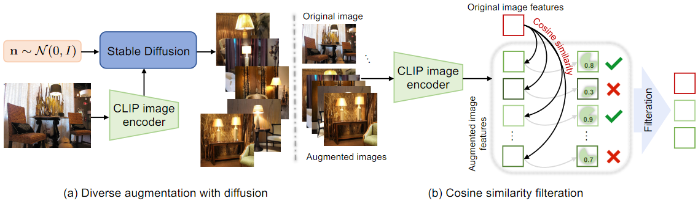

# Domain-Shift-Computer-Vision

In machine learning, domain shift refers to the difference in data distribution between the training and testing phases. As a result, models trained on one domain often perform poorly when applied to another, unseen domain, leading to degraded performance and unreliable predictions. Test Time Adaptation (TTA) is a technique designed to address this challenge by allowing the model to adapt to the new domain during inference, without requiring any additional labeled data. 

## Methods Implemented

 

- **Marginal Entropy Minimization with One test point (MEMO)**: Given a single test point and multiple augmentations we update the model by minimizing the entropy computed over the mean of the probabilities of each augmentation plus the original sample. This quantity is called marginal entropy and minimizing it encourages confident predictions and consistence across the augmentations. \\
Paper: [(M. Zhang, S. Levine, C. Finn, 2022)](https://proceedings.neurips.cc/paper_files/paper/2022/file/fc28053a08f59fccb48b11f2e31e81c7-Paper-Conference.pdf)

    

- **Entropy-based Confidence Selection**: The augmentation generated in MEMO can sometimes degrade the performance of the model. For this reason, we implement the entropy-based confidence selection strategy proposed by [http://arxiv.org/abs/2209.07511](M. Shu, W. Nie et al.). The entropy is computed for each augmentation and a number of the ones having the lowest entropy is retained to compute the marginal entropy and perform the model's update.

- **TTA: Test Time Augmentation**: Instead of making the final prediction using only the test sample, we produce some augmentations of the image and the `argmax` of the average of the predictions made for all the augmentations is used instead. TTA has been shown to be useful both for improving model accuracy as well as handling distribution shift by [(D. Molchanov, A. Lyzhov, 2020)](http://proceedings.mlr.press/v124/lyzhov20a.html)

- **Batch-Normalization Adaptation**: Proposed by [Schneider et al., 2020](https://proceedings.neurips.cc/paper/2020/hash/85690f81aadc1749175c187784afc9ee-Abstract.html), it involves updating the statistics (mean and variance) used in Batch Normalization layers during inference to better match the distribution of the new test data. The adaptation is performed using one test point and is controlled by a prior strength hyperparameter.

 

## Methods to Implement 

 

- **Synthetic Image Generation (CLIP + MEMO + Stable Diffusion)**: Traditional data augmentation methods are limited by insufficient data diversity. We re-adapt the DiffTPT method proposed by [(C. Feng, K. Yu, 2023)](https://ieeexplore.ieee.org/document/10376616/) to use it with MEMO. Specifically, we use a pre-trained diffusion model (Stable Diffusion) to generate diverse and informative new data. To avoid using misleading pictures, we use their cosine similarity-based filtration technique to select the generated data with higher similarity to the single test sample. Augmented data by both conventional method and pre-trained stable diffusion is incorporated, but with different percentages. The CLIP image encoder is used to select and produce the most similar generated images.

    

- **Synthetic Image Generation (CLIP + MEMO + Stable Diffusion + llama)**: DiffTPT is able to further help in case of domain shift test time adaptation by providing more diverse images to tune the prompt used in CLIP or to update models used in MEMO. However, it relies on the CLIP Image encoder to generate new images which might limit such variability. Moreover, generating images at test time slows down online inference and requires to generate new images each time. For this reason we propose a new approach which consists of generating a set of prompts using an LLM for each class. This prompt will then be used to generate new images with stable diffusion. At test time, we still use the CLIP image encoder to retrieve the most similar augmentations, but in this case we compare the embedding of the original image with all the synthetic images produced in advance. This cost should be much lower than generating new images for each test sample and still provide an accuracy improvement. We first try to combine the stored synthetic data only with the conventional augmentations and then also with the ones produced on the fly using the approach of [(C. Feng, K. Yu, 2023)](https://ieeexplore.ieee.org/document/10376616/).

 
